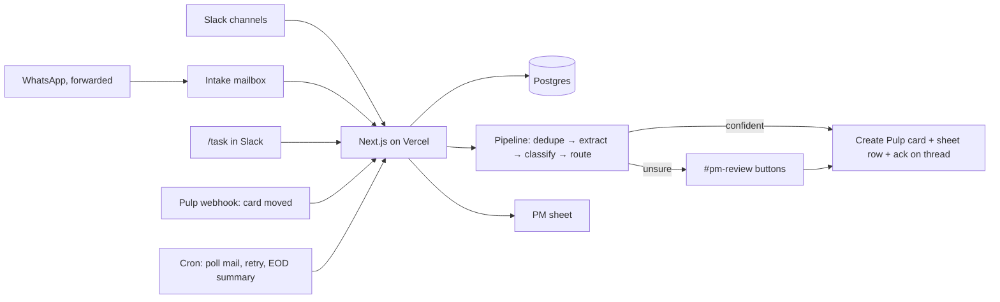

# Mangowise PM Automation — Plan (v0.2)

Guiding rule: **this exists to remove work, not add it.** Every piece below has to
earn its place by deleting a manual step. If it doesn't, it's out.

## 1. What it does, in one paragraph

A client says something, on whatever channel. It ends up in one place. The system
works out what is being asked, which client, which team, and how confident it is.
Clear cases become a card in Pulp and a row in the PM sheet, with a link back to the
original message. Unclear cases go to one Slack channel where a human clicks
Approve, Edit, Merge, or Not a task. When cards move in Pulp, the sheet follows.
At the end of the day, one summary message says what was created, what moved, and
what needs a decision.

## 2. Decisions (made, not open)

| Topic | Decision | Why |
|---|---|---|
| One agent or many | **One app.** One Slack bot, one deployment, one database. The "agents" in the brief are steps inside a single pipeline, each a Claude call with a strict JSON schema. | Multiple independent agents means multiple things to deploy, monitor and debug. Nothing here needs it. |
| Hosting | **Vercel** (you already have it). Next.js + TypeScript, Neon Postgres (free tier, integrates with Vercel in one click). | Uses what you have. Webhooks and scheduled jobs are all Vercel needs to do. |
| Scheduling | Vercel Cron, per-minute (we are on **Pro**). | Function time limit on Pro is 800s, far more than a message needs. |
| Hermes on a VPS | **Considered, not chosen** for the pipeline. Hermes is a conversational agent: it answers when mentioned and decides for itself which tools to call. This system is the opposite: it must silently process *every* message, produce the same structured result every time, dedupe against a database, and never create a card twice. That is a pipeline, not a chat agent. Hermes would also be a second server to keep alive. | The one thing Hermes has that Vercel cannot is a WhatsApp bridge that links to the business phone by QR code (Baileys). It is unofficial and carries account-ban risk on a client-facing number. If WhatsApp forwarding proves too annoying in Phase 1, a tiny bridge like that on a $5 VPS, posting into the Vercel intake endpoint, is the Phase 2 option to evaluate, with the risk stated. |
| Board | **Pulp**, via its API. Since we own Pulp, add **one webhook** in Pulp: "card moved list". That replaces polling for status sync. | Simplest possible status sync. |
| Source of truth | Postgres owned by the app. Pulp and the sheet are written *from* it. | Dedupe, audit trail, and "why did it do that?" need one place that remembers everything. |
| Slack | One Slack app, added to the client channels. Free plan is fine: Events API and slash commands work on free. Assumption: those channels live in **Mangowise's** workspace (clients as guests). If a client channel lives in the client's own workspace, their admin has to install the app, or that client's messages come via forwarding. | |
| Email | One Gmail inbox (Google Workspace), e.g. `pm@…`. Anything sent or forwarded there is intake. Ad-platform notifications already come by email, so they need no separate integration. | |
| WhatsApp | **Phase 1: forward.** Staff forward the WhatsApp message to the intake email, or paste it with `/task` in Slack. The WhatsApp Business *app* has no API, so there is no clean way to read it. **Phase 2, optional:** move the business number to WhatsApp Business Platform (Cloud API). Messages then arrive by webhook like Slack, but the phone app stops working for that number and replies go through an inbox tool. Decide after Phase 1 is live. | Forwarding costs 5 seconds per message and needs nothing built. Migrating the number is a real change to how you talk to clients. |
| Google Meet | **Yes, same pipeline.** After a call, Gemini's notes doc lands in Drive and the transcript is available via the Meet API; the Workspace Events API tells us when. Client is resolved from the calendar invite's attendees. Extraction separates **our tasks** (become cards), **client to-dos** (stored, shown in hub and EOD as "client owes us…"), and **decisions** (decision log). Meetings *always* go to `#pm-review` as **one batch** ("8 tasks from the call with X: approve all / edit"), even after the gate opens for Slack and email. | Transcripts are less certain than written asks, and a bad batch on a client board is expensive. |
| Internal corner | Every item has a **scope: client or internal**. Internal meetings (no external attendees) and internal channels are scope=internal. Internal **tasks** → internal Pulp board, owner = whoever was named. **Ideas** → an ideas backlog, never a board, resurfaced in a weekly summary. **Decisions** → decision log linked to the meeting. | One extra field and two extra item types cover the whole internal case. Ideas on a task board get ignored; ideas in a backlog with a weekly reminder don't get lost. |
| Review queue | One Slack channel, `#pm-review`, with buttons. No separate UI. | People already live in Slack. |
| PM sheet | Written by the app. Bot-owned columns vs human-owned columns (§5). | A hand edit must never get overwritten. |
| Phase 1 gate | **Everything goes to `#pm-review` first**, even confident cases, for the first ~2 weeks. | The approve/edit clicks give us real data to set thresholds. Then we open the gate. |

## 3. Architecture



Endpoints:

- `POST /api/slack/events` — messages in client channels, `/task` command, button clicks
- `POST /api/pulp/webhook` — card moved / completed
- `GET  /api/tick` — every 1–5 min: poll Gmail, retry failed steps
- `GET  /api/eod` — once a day: post summary

Database (four tables, that's all):

- `messages` — raw inbound, channel, sender, resolved client, permalink, hash
- `requests` — one per distinct ask: summary, classification, confidence, review state
- `tasks` — one per Pulp card: pulp id, list, sheet row, linked request. This is the audit trail.
- `status_events` — every list change, timestamped. Feeds the sheet and the EOD summary.

## 4. Pipeline

1. **Normalise.** Any channel → one `Message` shape. Resolve client from a config
   table (Slack channel → client, email domain → client). The model never guesses
   the client.
2. **Dedupe.** Same client, same text hash → merge silently. Same client, high
   similarity to an open request → merge and reply "already tracked as TASK-123".
   Middle band → review queue as "possible duplicate".
3. **Extract.** One Claude call, strict JSON: bullet summary, list of distinct asks
   (a message can contain three), a quote for each, any deadline or URL.
4. **Classify.** Per ask: department, request type, priority hint, **confidence and
   the reason**. Then the routing table (§6) decides where it goes.
5. **Gate.** Confident → create. Unsure → `#pm-review`.
6. **Create.** Pulp card, sheet row, `tasks` row, and a reply on the original
   Slack thread / email with the card link.
7. **Sync.** Pulp webhook → `status_events` → sheet row updated.
8. **EOD.** Summary to Slack + email (§7).

## 4b. The hub: PMs connect their own assistant

The database is the hub. It is exposed over **MCP** (the protocol Claude and Codex
both use) as one more route in the same Next.js app, with a per-PM key. Any PM adds
one connection to their own Claude or Codex and can then ask questions, draft, and
visualise against live data, using their own assistant.

Tools the hub exposes (small on purpose):

- **Read:** tasks by client / stage / department, the original message behind a task,
  status history, the review queue.
- **Draft:** a task, a client status update, an EOD or weekly summary. Text the PM edits.
- **Write, gated:** create or move a task, resolve a review item. Same code path as
  the Slack buttons, so the audit trail is identical whoever triggered it.

The PM sheet stays as the zero-setup, shareable view. The MCP hub is the primary
window for anyone with an assistant.

Consequence: the schema and the audit trail *are* the product. A hub with one
duplicate card gives every PM's assistant a confidently wrong answer, which is the
main reason the intake pipeline must be deterministic rather than an agent loop.

## 5. PM sheet contract

Still to be reconciled with the real sheet (Drive connector needs re-authorising).

- **Bot-owned:** Task ID, Client, Department, Type, Title, Pulp link, Source, Source
  link, Created, Stage, Last moved, Completed.
- **Human-owned, never overwritten:** Priority, Owner, PM notes, Client ETA.

## 6. Routing rules (config, not prompt)

| Request type | Route |
|---|---|
| New page | Parent card + ordered sub-cards: SEO research → Content → Web dev → Graphic design → Client approval → Build → Menu linking. Next one unblocks when the previous completes. |
| Content feedback | Content board |
| Dev feedback / issue | Dev board |
| Graphic issue | Design board; on completion, auto-create the dev card to push it live |
| General update / question | No card. Logged; shows in EOD as "client updates". |
| Low confidence | `#pm-review` |

## 7. End-of-day summary

```
Mangowise PM summary — Mon 7 Sep

Created (N)          [Client] TASK-131  Dev — Fix booking button on /contact  (Slack)
Moved (N)            [Client] TASK-118  Content → Web development
Completed (N)        …
Needs a decision (N) Possible duplicate: TASK-129 vs email from …  [review]
Updates, no task (N) …
```

## 8. Build order

| Phase | Ships | Manual work removed |
|---|---|---|
| 1 | Slack + email + `/task` intake, dedupe, extract, classify, `#pm-review` with buttons, Pulp card + sheet row + ack | Nobody watches channels. PM approves drafted tasks instead of writing them. |
| 2 | Confidence gate opens, Pulp webhook → sheet, EOD summary, **MCP hub** (§4b) | PM approves only unsure ones. Sheet updates itself. PMs query and draft from their own Claude/Codex. |
| 3 | Google Meet intake (client + internal), ideas backlog, decision log, new-page chain, graphic→dev follow-up, WhatsApp Cloud API if wanted | Meeting actions never get lost. Full routing rules live. |

## 9. Needed to start Phase 1

1. **Pulp API:** base URL, auth method, and the endpoints for boards, lists, cards
   (create, move, get). A link to the code or a Postman collection is ideal.
2. **PM sheet:** re-authorise the Google Drive connector, or paste tab names + headers.
3. **Client map:** client name → Slack channel(s), email domain(s). A short list is fine.
4. **Vercel plan:** Hobby or Pro (only affects how the tick is scheduled).
5. **Slack:** confirm the client channels are in Mangowise's workspace.

## Appendix A. Why a deterministic pipeline and not Hermes (shareable)

Hermes is a good personal agent. It is the wrong shape for the intake pipeline and
the hub. The reasons, in order of weight:

1. **Hermes's memory is notes; this needs a ledger.** Hermes remembers things about
   its operator: preferences, context, learned skills. That memory is unstructured,
   per-user, and approximate by design. The hub must answer "which open dev tasks
   exist for Clinic X, which message did each come from, when did each move stage"
   correctly, for every PM, every time. That is a database with a schema. Using an
   agent's memory as a shared team ledger is where duplicates and wrong answers come
   from.
2. **The agent loop is for unknown steps. Intake has known steps.** A loop earns its
   cost when the model must work out what to do next. Intake is the same six steps
   every time. Running them in a loop adds variance, latency and cost and adds no
   capability. Concrete case: the same request arrives on Slack, then by email an hour
   later. The pipeline checks the database in a transaction before creating anything
   and merges. A loop in a fresh session may or may not check, and may create a second
   card. "Usually remembers" is not a property a hub can be built on.
3. **We keep the loop, at the human's end.** Open-ended reasoning is useful when a PM
   asks questions, drafts a client update, or makes a chart. They get exactly that
   from their own Claude / Codex / Hermes, connected to the hub over MCP. The loop
   sits with the person who can correct it. The plumbing stays deterministic.
4. **Many users, not one operator.** Hermes is one operator per gateway. The hub has
   several PMs with their own keys, and the audit trail records who created or moved
   what, from a Slack button, an assistant, or the pipeline.
5. **Tuning needs fixed outputs.** The review-everything phase compares the model's
   structured classification with the human's approve / edit click. That only works if
   every message yields the same JSON shape. Free-form loop output cannot be scored.
6. **Cost and failure are bounded.** Two model calls per message, known in advance.
   On Vercel a failed step stays queued and retries. A Hermes process that dies on a
   VPS at 2am stops intake silently.
7. **Operations.** Vercel is already ours and needs no babysitting. Hermes needs a
   server kept alive and updated, and its unofficial WhatsApp bridge carries an
   account-ban risk on a client-facing number.

What Hermes genuinely has over this: a faster first demo, model choice out of the box,
and the WhatsApp QR bridge. The first is worth a couple of days; the second is a
two-prompt swap in our code; the third is a risk we should not take on a client number.

**Resolution:** nobody gives up Hermes. Hermes speaks MCP, so it becomes a client of
the hub with its loop and memory intact, on top of data that is guaranteed correct.
That is the same position every other PM's Claude or Codex will be in.
