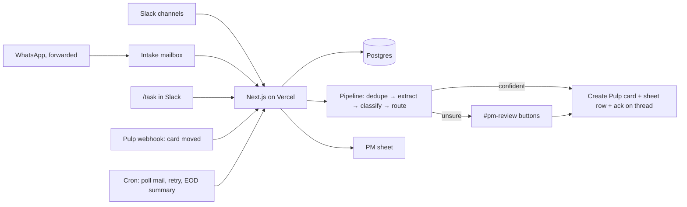

# MangoEyes PM Automation — Plan (v0.2)

Guiding rule: **this exists to remove work, not add it.** Every piece below has to
earn its place by deleting a manual step. If it doesn't, it's out.

## 1. What it does, in one paragraph

A client says something, on whatever channel. It ends up in one place. The system
works out what is being asked, which client, which team, and how confident it is.
Clear cases become a card in Pulp and a row in the PM sheet, with a link back to the
original message. Unclear cases go to one Slack channel where a human clicks
Approve, Edit, Merge, or Not a task. When cards move in Pulp, the sheet follows.
At the end of the day, one summary message says what was created, what moved, and
what needs a decision.

## 2. Decisions (made, not open)

| Topic | Decision | Why |
|---|---|---|
| One agent or many | **One app.** One Slack bot, one deployment, one database. The "agents" in the brief are steps inside a single pipeline, each a Claude call with a strict JSON schema. | Multiple independent agents means multiple things to deploy, monitor and debug. Nothing here needs it. |
| Hosting | **Vercel** (you already have it). Next.js + TypeScript, Neon Postgres (free tier, integrates with Vercel in one click). | Uses what you have. Webhooks and scheduled jobs are all Vercel needs to do. |
| Scheduling | Vercel Cron, per-minute (we are on **Pro**). | Function time limit on Pro is 800s, far more than a message needs. |
| Hermes | **Not the runtime; optional client.** Intake is event-driven: a message arrives, the same fixed steps run, a card is created. Hermes is an always-on assistant that runs code only when its agent decides to, and it cannot run on Vercel, so it adds nothing to intake. The hub connects to Claude and Codex directly over MCP. Hermes is only added, on the VPS, if the team wants to chat with the hub from Slack or Telegram; then it sits beside the system as one more client, never inside it. | Cost is a wash (Hermes is free, the VPS exists, Vercel is paid). The difference is operations and coupling, not money. |
| Board | **Pulp**, via its API. Since we own Pulp, add **one webhook** in Pulp: "card moved list". That replaces polling for status sync. | Simplest possible status sync. |
| Source of truth | Postgres owned by the app. Pulp and the sheet are written *from* it. | Dedupe, audit trail, and "why did it do that?" need one place that remembers everything. |
| Slack | One Slack app, added to the client channels. Free plan is fine: Events API and slash commands work on free. Assumption: those channels live in **MangoEyes's** workspace (clients as guests). If a client channel lives in the client's own workspace, their admin has to install the app, or that client's messages come via forwarding. | |
| Slack, forwarded instead of a bot? | **Both, same intake.** Automatic where the bot can live (channels in our workspace). A `#intake` channel in our workspace is the universal manual path: anyone uses Slack's "Share message" to send a message there from any channel, or pastes a WhatsApp / phone-call ask there. The bot reads `#intake` like any channel; a shared message carries the original text and permalink, so the audit link survives. | Manual forwarding brings back the one step this project exists to remove ("someone has to notice"), so it is the fallback, not the default. It is the right answer when a client channel lives in the client's own workspace and their admin won't install the bot. |
| Email | One Gmail inbox (Google Workspace), e.g. `pm@…`. Anything sent or forwarded there is intake. Ad-platform notifications already come by email, so they need no separate integration. | |
| WhatsApp | **Phase 1: forward.** Staff forward the WhatsApp message to the intake email, or paste it with `/task` in Slack. The WhatsApp Business *app* has no API, so there is no clean way to read it. **Phase 2, optional:** move the business number to WhatsApp Business Platform (Cloud API). Messages then arrive by webhook like Slack, but the phone app stops working for that number and replies go through an inbox tool. Decide after Phase 1 is live. | Forwarding costs 5 seconds per message and needs nothing built. Migrating the number is a real change to how you talk to clients. |
| Google Meet | **Yes, same pipeline.** After a call, Gemini's notes doc lands in Drive and the transcript is available via the Meet API; the Workspace Events API tells us when. Client is resolved from the calendar invite's attendees. Extraction separates **our tasks** (become cards), **client to-dos** (stored, shown in hub and EOD as "client owes us…"), and **decisions** (decision log). Meetings *always* go to `#pm-review` as **one batch** ("8 tasks from the call with X: approve all / edit"), even after the gate opens for Slack and email. | Transcripts are less certain than written asks, and a bad batch on a client board is expensive. |
| Internal corner | Every item has a **scope: client or internal**. Internal meetings (no external attendees) and internal channels are scope=internal. Internal **tasks** → internal Pulp board, owner = whoever was named. **Ideas** → an ideas backlog, never a board, resurfaced in a weekly summary. **Decisions** → decision log linked to the meeting. | One extra field and two extra item types cover the whole internal case. Ideas on a task board get ignored; ideas in a backlog with a weekly reminder don't get lost. |
| Review queue | One Slack channel, `#pm-review`, with buttons. No separate UI. | People already live in Slack. |
| PM sheet | Written by the app. Bot-owned columns vs human-owned columns (§5). | A hand edit must never get overwritten. |
| Review gate | **Everything goes to `#pm-review` first**, even confident cases. The gate opens per request type on evidence: 30 approvals with ≥95% unedited, never sooner than 3 days. Meetings always stay reviewed. | The approve/edit clicks are the only honest source for thresholds. |

## 3. Architecture



Endpoints:

- `POST /api/slack/events` — messages in client channels, `/task` command, button clicks
- `POST /api/pulp/webhook` — card moved / completed
- `GET  /api/tick` — every 1–5 min: poll Gmail, retry failed steps
- `GET  /api/eod` — once a day: post summary

Database (five tables, that's all):

- `messages` — raw inbound, channel, sender, resolved client, permalink, hash
- `requests` — one per distinct ask: summary, classification, confidence, review state
- `tasks` — one per Pulp card: pulp id, list, sheet row, linked request. This is the audit trail.
- `status_events` — every list change, timestamped. Feeds the sheet and the EOD summary.
- `llm_calls` — one row per model call: which step, model, input / cached / output
  tokens, cost, latency. Feeds the EOD spend line and the cache check.

## 4. Pipeline

1. **Normalise.** Any channel → one `Message` shape. Resolve **scope** (client or
   internal) and **client** from config, in code. The model never guesses either.

   | Source | Client work | Internal work |
   |---|---|---|
   | Slack channel | Channel is in the client map → that client | Channel is in the internal list (e.g. `#team`, `#ideas`) → internal |
   | `#intake` share / `/task` | Origin channel of the shared message decides; otherwise the bot asks one question: "Which client, or internal?" | Same |
   | Email | Sender domain (or the quoted original's sender, on a forward) matches a client | Sender is a MangoEyes address and nothing client-related is quoted |
   | Google Meet | Any attendee domain matches a client → that client | All attendees are MangoEyes → internal |
   | Unknown | → `#pm-review` tagged "unknown client", no model call | |

   Everything downstream is the same pipeline with `scope` as a field: internal
   tasks route to the internal board, client tasks to client boards; ideas and
   decisions exist for both scopes; `#pm-review` is one channel with a scope tag;
   the EOD summary has a client section and an internal section; the sheet has an
   Internal tab; the hub takes `scope` as a filter. One system, one field, two views.
2. **Dedupe.** Same client, same text hash → merge silently. Same client, high text
   similarity (Postgres `pg_trgm`, no embeddings service) to an open request → merge
   and reply "already tracked as TASK-123". Grey zone → the classify call is given the
   open request titles for that client and answers "same as one of these?" in its JSON;
   a yes goes to review as "possible duplicate".
3. **Extract.** One Claude call, strict JSON: bullet summary, list of distinct asks
   (a message can contain three), a quote for each, any deadline or URL.
4. **Classify.** Per ask: department, request type, priority hint, **confidence and
   the reason**. Then the routing table (§6) decides where it goes.
5. **Gate.** Confident → create. Unsure → `#pm-review`.
6. **Create.** Pulp card (owner, priority, due date set), sheet row, `tasks` row, and
   an **internal** acknowledgement: emoji reaction on the source message + card link
   in `#pm-review`. Client-facing replies only if enabled per client (§4f).
7. **Sync.** Pulp webhook → `status_events` → sheet row updated.
8. **EOD.** Summary to Slack + email (§7).

## 4b. The hub: PMs connect their own assistant

The database is the hub. It is exposed over **MCP** (the protocol Claude and Codex
both use) as one more route in the same Next.js app, with a per-PM key. Any PM adds
one connection to their own Claude or Codex and can then ask questions, draft, and
visualise against live data, using their own assistant.

Tools the hub exposes (small on purpose):

- **Read:** tasks by client / stage / department, the original message behind a task,
  status history, the review queue.
- **Draft:** a task, a client status update, an EOD or weekly summary. Text the PM edits.
- **Write, gated:** create or move a task, resolve a review item. Same code path as
  the Slack buttons, so the audit trail is identical whoever triggered it.

The PM sheet stays as the zero-setup, shareable view. The MCP hub is the primary
window for anyone with an assistant.

Consequence: the schema and the audit trail *are* the product. A hub with one
duplicate card gives every PM's assistant a confidently wrong answer, which is the
main reason the intake pipeline must be deterministic rather than an agent loop.

## 4c. Running cost

Only two steps call a model (extract, classify + draft). Everything else is code. The
hub serves data; a PM's questions to it are answered by *their* assistant on *their*
subscription, so conversational cost never lands on the API bill.

Per message, about 5,000 input tokens (≈4,000 of them a cached prefix) and ≈700 output
tokens. First-party Anthropic prices, cache reads at 0.1× input:

| Model | Per message | 500 msgs / month | 20 meetings / month | Monthly |
|---|---|---|---|---|
| Haiku 4.5 | ~$0.005 | ~$2.50 | ~$0.40 | ~$3 |
| **Sonnet 5 (default)** | ~$0.01 | ~$5 | ~$0.70 | ~$6 |
| Opus 5 | ~$0.025 | ~$12.50 | ~$1.70 | ~$14 |

How it stays there is specified in §4d (noise filter) and §4e (caching). Also:
Batch API for meetings (50% off, they are reviewed as a batch anyway); a spend limit
in the Anthropic console; per-call token usage logged to the database and shown in
the EOD summary; model is one config line.

Everything else is already paid for or free at this volume: Vercel Pro, Neon Postgres
free tier, Slack free plan, Google APIs.

## 4d. Noise filter: what never reaches a model

Every rule below runs in code, before any model call, and is logged with the reason
so "why was this ignored?" is always answerable. Anything skipped is still stored
as a `message` row; it just never becomes a `request`.

**Slack**

| Rule | Action |
|---|---|
| Author is MangoEyes staff (from the client map) and channel is not `#intake` | Skip. Staff talk is not client requests. `/task` and `#intake` are the staff paths in. |
| Bot messages, joins/leaves, edits, deletions, pins, reactions | Skip. Only `message` events with text from a human. |
| Text under 15 characters, or matches the acknowledgement list (`thanks`, `ok`, `great`, `noted`, `sure`, `👍`, `done`, and their variants) | Skip. |
| Reply inside a thread whose root already became a request | Attach to that request as context, no model call. Exception: the reply is over 200 characters, then it runs the pipeline as a follow-up ask. |
| Only an attachment, no text | No model call. Goes to `#pm-review` as "attachment only, from Clinic X" so a person decides. |
| Same client, same text hash as a message in the last 14 days | Skip as exact duplicate, reply "already tracked as TASK-n" if a task exists. |
| Per-client cap of 100 model calls a day | Above the cap, messages queue for review instead of the model. A safety valve, expected never to trigger. |

**Email**

| Rule | Action |
|---|---|
| Sent by MangoEyes (our own outgoing, or a staff address) and not a forward | Skip. |
| `Auto-Submitted`, `Precedence: bulk/list`, unsubscribe headers, known no-reply senders | Skip. Ad-platform senders on an allowlist are the exception and go through. |
| Quoted history in a reply or forward | Stripped. Only the newest part is sent to the model. Cuts tokens by 60–90% on long threads. |
| Attachments | Names and types are passed as text; contents are not sent to the model in phase 1. |
| Same subject thread already linked to a request | Attach as context, no model call, unless the new part is over 200 characters. |

**Meetings**

| Rule | Action |
|---|---|
| Calendar event with no external attendees and not tagged internal | Skip. |
| Transcript under 150 words | Skip, logged as "too short". |
| Notes doc exists | Send the Gemini notes doc first (short). Send the transcript only if the notes have no action items section. |

Expected effect: well over half of raw Slack traffic and most of the mailbox never
costs anything. What reaches the model is client-authored, non-trivial, and new.

## 4e. Prompt caching, exactly how

Both model calls use the same request layout so the cached prefix is shared:

```
system:
  [1] static instructions for this call      ← cache_control: ephemeral, ttl: 1h
  [2] routing table + client list (from config)  ← cache_control: ephemeral, ttl: 1h
messages:
  user: { client, channel, open request titles for this client, the message text }
```

- **Why 1-hour, not 5-minute.** Messages arrive 5 to 60 minutes apart during the
  day. A 5-minute cache would miss most of the time. The 1-hour cache costs 2× on
  the first write and 0.1× on every read after, and each read renews it, so during
  working hours it stays warm on its own. Sonnet 5 caches any prefix over 1,024
  tokens; ours is about 4,000.
- **Nothing volatile in the prefix.** No timestamps, no message IDs, no per-client
  data in `system`. Client-specific context goes in the user turn, after the
  breakpoint. Config is rendered in a fixed key order so the bytes never drift.
- **Config changes invalidate the cache once.** Editing `routing.yaml` costs one
  re-write. That is fine and expected.
- **Verified, not assumed.** Every call logs `cache_read_input_tokens` and
  `cache_creation_input_tokens` to the `llm_calls` table. If reads are zero across
  a day, the EOD summary says so.
- **Outputs are schema-bound.** `output_config.format` with a JSON schema for both
  calls, `max_tokens` capped around 800 for extract and 1,000 for classify + draft.
  No prose, no markdown, no explanations beyond the one-line `reason` field.
- **Honest scale note.** At 4,000 prefix tokens the cache saves fractions of a
  cent per message. It is done because it is the correct layout and it costs nothing
  to do right, not because it changes the bill at this volume.

## 4f. Team review additions (accepted)

| Item | Decision |
|---|---|
| Client → board → assignee map | The client map lives in a **Config tab of the PM sheet**: sender / channel / number → client → board per department → default list → default assignee. Read by the hub every few minutes, validated; a bad row goes to review, never breaks intake. Unknown sender → review lane. |
| Priority | P1–P3 on every card. Keyword list in config forces P1 (site down, broken form, leads not coming, ad disapproved, payment failed). P1 pings a Slack channel immediately, also in review mode. Keywords only raise priority, never lower it. |
| Multi-request splitting | Already the design: one card per distinct ask, all linked to the same source message. |
| Thread continuity | A match has **three outcomes**: duplicate → merge; nudge ("any update?") → comment on the existing card + "client waiting" flag, shown in EOD; change request → review as a follow-up on that card. Nothing silently dropped. |
| Scope gate | New page / new feature → **"Needs scope"** list first. A person moves it into the chain or marks it covered by the retainer. Routing table gets a `gated: true` flag per type. |
| Client approval loop | The hub never messages a client on its own. A person sends the preview; the hub records "waiting on client since", detects the reply via normal intake and moves the card, and nudges the **PM** after N days (config). Client-facing nudges exist only as drafts a PM sends. |
| Reply to source | **Correction.** Default acknowledgement is internal: an emoji reaction on the message + card link in `#pm-review`. No automatic email reply to clients. Client-facing acknowledgement is opt-in per client with fixed, PM-approved wording. |
| Assignee + SLA | Default owner from the map. Default SLA per request type in config (working days); P1 has its own. Due date set at creation. EOD gains an **Overdue** bucket. |
| Stage handoff | On stage completion the hub copies asset links from the finished card to the next card. No attachments → it asks the designer in a card comment instead of moving on. |
| Kill switch + shadow mode | One toggle pauses all intake, one per channel; paused messages queue, never vanish. Shadow mode = every draft goes to `#pm-review` **and** is created as a real card in a **Staging** list on the right board (Pulp is internal-only, confirmed, so nothing leaks). Approve in Slack, or drag the card out of Staging; either counts, one state. Bulk days are a drag-select. |
| Weekly per-client digest | Friday, per client: done / in progress / waiting on client / overdue. Sent to the PM as a draft to forward or reuse in reporting. |
| Source retention | Already stored in full in the hub. Addition: the card description carries the quoted original text, not only the link. |

Effect on the 24-hour plan: about 4 extra hours (priority, scope gate, SLA/overdue,
three-way thread handling, kill switch, asset handoff) folded into hours 13–22. The
weekly digest and approval-loop nudges need live data first and land in the days
after go-live.

## 5. PM sheet contract

Still to be reconciled with the real sheet (Drive connector needs re-authorising).

- **Bot-owned:** Task ID, Client, Department, Type, Title, Pulp link, Source, Source
  link, Created, Stage, Last moved, Completed.
- **Human-owned, never overwritten:** Priority, Owner, PM notes, Client ETA.

## 6. Routing rules (config, not prompt)

| Request type | Route |
|---|---|
| New page / new feature | **Needs scope** list first (a person moves it on). Then parent card + ordered sub-cards: SEO research → Content → Web dev → Graphic design → Client approval → Build → Menu linking. Next one unblocks when the previous completes; asset links carried forward. |
| Content feedback | Content board |
| Dev feedback / issue | Dev board |
| Graphic issue | Design board; on completion, auto-create the dev card to push it live |
| General update / question | No card. Logged; shows in EOD as "client updates". |
| Low confidence | `#pm-review` |

## 7. End-of-day summary

```
MangoEyes PM summary — Mon 7 Sep

Created (N)          [Client] TASK-131  Dev — Fix booking button on /contact  (Slack)
Moved (N)            [Client] TASK-118  Content → Web development
Completed (N)        …
Overdue (N)          [Client] TASK-102  Design — due Mon, P2
Needs a decision (N) Possible duplicate: TASK-129 vs email from …  [review]
Waiting on client (N) [Client] TASK-118  preview sent Tue, no reply
Updates, no task (N) …
```

## 8. Build order: 24 working hours, two people, everything in

Not a calendar. Twenty-four hours of build with both of us on it (two long days or
three focused sessions). Admin steps run in parallel and each blocks the build if it
waits. The team-review additions are built inside the passes that touch the same
code (priority, SLA, assignee, staging → create step; kill switch → intake; scope
gate → routing flag; three-way thread → dedupe), about 3 hours absorbed by denser
middle blocks and one hour taken from the hub block. Soak goes up, not down.

| Hours | Built | Arun, in parallel | Milestone |
|---|---|---|---|
| 0–1 | Scaffold, schema, config, Config tab in the PM sheet | Slack app (manifest provided), Vercel, Neon, API key, Pulp access, client list into the Config tab | |
| 1–4 | Slack intake, noise filter, kill switch, extract + classify prompts, P1 keywords + instant ping, `#pm-review` buttons | App into a test channel, real messages | Drafts in review |
| 4–6 | Pulp create card (owner, priority, due date from SLA), Staging list, sheet writer, internal ack | Board/list names, add a Staging list per board | **A.** Slack → card, row, ack |
| 6–8 | Gmail intake, email filter, `#intake` share, `/task`, three-way thread handling | Mailbox access, CC a real thread, reply "any update?" | All channels feeding |
| 8–10 | Status sync (poll until webhook), drag-out-of-Staging = approve, EOD with Overdue + Waiting on client | Move a card, drag one out of Staging, read the summary | **B.** Sheet self-updates |
| 10–12 | MCP hub, per-PM keys, internal scope | Connect own Claude, ask questions | **C.** Ask the hub |
| 12–15 | Meet notes from the Drive folder, batch review, client to-dos, decisions, ideas | Share the notes folder, one real call with notes on | Meeting actions → drafts |
| 15–18 | Scope gate, new-page chain, asset links carried forward, graphic → dev follow-up, weekly ideas resurface | Walk through a real new-page ask | Full routing live |
| 18–22 | Soak on live traffic, fixes, filter tuning, spend limit, monitoring | Watch `#pm-review` and Staging | |
| 22–24 | Handover, team habits, review-everything on | Brief the team | **D.** Live |

**Cut order if something slips** (features before soak): weekly ideas resurface →
asset links carried forward → Staging list (Slack review alone works) → Meet notes
(forward the notes doc by hand for a day). Weekly per-client digest and approval-loop
nudges land in the days after go-live; they need live data first.

**Cannot be compressed by effort:**

- *Google's side of meetings.* Full transcripts via the Meet + Workspace Events APIs
  need a Cloud project, consent screens and a Workspace admin. Day one uses the
  Gemini notes doc in the Drive "Meet Recordings" folder, polled every few minutes.
- *The review gate.* Opens on evidence: per request type, once 30 approvals have gone
  through with ≥95% unedited, and never sooner than 3 days. Meetings always reviewed.

**Removed so they cannot block:** the Pulp webhook (polled until added) and any
embeddings service. **Could add hours:** a client channel in the client's own Slack
workspace, a Pulp corner that differs from Trello, Google access held by someone
not in the room.

## 9. Needed at hour 0

1. **Pulp API:** base URL, auth method, and the endpoints for boards, lists, cards
   (create, move, get). A link to the code or a Postman collection is ideal.
2. **PM sheet:** re-authorise the Google Drive connector, or paste tab names + headers.
3. **Client map:** client name → Slack channel(s), email domain(s). A short list is fine.
4. **Vercel plan:** Hobby or Pro (only affects how the tick is scheduled).
5. **Slack:** confirm the client channels are in MangoEyes's workspace.

## Appendix A. Why a deterministic pipeline and not Hermes (shareable)

**Short version.** Our app runs on Vercel because intake is event-driven: a message
arrives, the same fixed steps run, a card is created, and no server needs to stay on.
Hermes is an always-on assistant that cannot run on Vercel and only executes code
when its agent decides to, so it adds nothing to intake. The hub connects directly to
Claude and Codex over MCP, which covers every PM's questions, drafts, and charts. We
would only add Hermes, on the VPS, if the team wants to chat with the hub from Slack
or Telegram, and even then it sits beside the system as one more client, never
inside it. Cost is not the reason: Hermes is free and the VPS exists.

**Longer version.** Hermes is a good personal agent. It is the wrong shape for the
intake pipeline and the hub. The reasons, in order of weight:

1. **Hermes's memory is notes; this needs a ledger.** Hermes remembers things about
   its operator: preferences, context, learned skills. That memory is unstructured,
   per-user, and approximate by design. The hub must answer "which open dev tasks
   exist for Clinic X, which message did each come from, when did each move stage"
   correctly, for every PM, every time. That is a database with a schema. Using an
   agent's memory as a shared team ledger is where duplicates and wrong answers come
   from.
2. **The agent loop is for unknown steps. Intake has known steps.** A loop earns its
   cost when the model must work out what to do next. Intake is the same six steps
   every time. Running them in a loop adds variance, latency and cost and adds no
   capability. Concrete case: the same request arrives on Slack, then by email an hour
   later. The pipeline checks the database in a transaction before creating anything
   and merges. A loop in a fresh session may or may not check, and may create a second
   card. "Usually remembers" is not a property a hub can be built on.
3. **We keep the loop, at the human's end.** Open-ended reasoning is useful when a PM
   asks questions, drafts a client update, or makes a chart. They get exactly that
   from their own Claude / Codex / Hermes, connected to the hub over MCP. The loop
   sits with the person who can correct it. The plumbing stays deterministic.
4. **Many users, not one operator.** Hermes is one operator per gateway. The hub has
   several PMs with their own keys, and the audit trail records who created or moved
   what, from a Slack button, an assistant, or the pipeline.
5. **Tuning needs fixed outputs.** The review-everything phase compares the model's
   structured classification with the human's approve / edit click. That only works if
   every message yields the same JSON shape. Free-form loop output cannot be scored.
6. **Cost and failure are bounded.** Two model calls per message, known in advance.
   On Vercel a failed step stays queued and retries. A Hermes process that dies on a
   VPS at 2am stops intake silently.
7. **Operations, not money.** Vercel is already ours and needs no babysitting. Our
   app could run on the VPS too, in an hour; Hermes must, because it is always on.
   Sharing a box couples intake to Hermes updates. Its unofficial WhatsApp bridge
   also carries an account-ban risk on a client-facing number.

What Hermes genuinely has over this: a faster first demo, model choice out of the box,
and the WhatsApp QR bridge. The first is worth a couple of days; the second is a
two-prompt swap in our code; the third is a risk we should not take on a client number.

**Resolution:** nobody gives up Hermes. Hermes speaks MCP, so it becomes a client of
the hub with its loop and memory intact, on top of data that is guaranteed correct.
That is the same position every other PM's Claude or Codex will be in.
