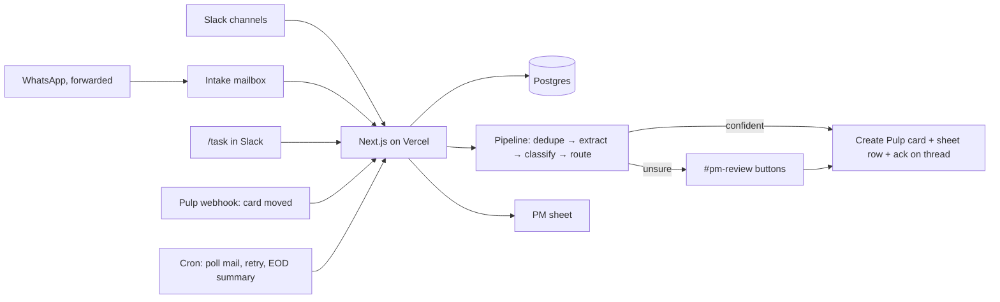

# Mangowise PM Automation — Plan (v0.2)

Guiding rule: **this exists to remove work, not add it.** Every piece below has to
earn its place by deleting a manual step. If it doesn't, it's out.

## 1. What it does, in one paragraph

A client says something, on whatever channel. It ends up in one place. The system
works out what is being asked, which client, which team, and how confident it is.
Clear cases become a card in Pulp and a row in the PM sheet, with a link back to the
original message. Unclear cases go to one Slack channel where a human clicks
Approve, Edit, Merge, or Not a task. When cards move in Pulp, the sheet follows.
At the end of the day, one summary message says what was created, what moved, and
what needs a decision.

## 2. Decisions (made, not open)

| Topic | Decision | Why |
|---|---|---|
| One agent or many | **One app.** One Slack bot, one deployment, one database. The "agents" in the brief are steps inside a single pipeline, each a Claude call with a strict JSON schema. | Multiple independent agents means multiple things to deploy, monitor and debug. Nothing here needs it. |
| Hosting | **Vercel** (you already have it). Next.js + TypeScript, Neon Postgres (free tier, integrates with Vercel in one click). | Uses what you have. Webhooks and scheduled jobs are all Vercel needs to do. |
| Scheduling | Vercel Cron, per-minute (we are on **Pro**). | Function time limit on Pro is 800s, far more than a message needs. |
| Hermes on a VPS | **Considered, not chosen** for the pipeline. Hermes is a conversational agent: it answers when mentioned and decides for itself which tools to call. This system is the opposite: it must silently process *every* message, produce the same structured result every time, dedupe against a database, and never create a card twice. That is a pipeline, not a chat agent. Hermes would also be a second server to keep alive. | The one thing Hermes has that Vercel cannot is a WhatsApp bridge that links to the business phone by QR code (Baileys). It is unofficial and carries account-ban risk on a client-facing number. If WhatsApp forwarding proves too annoying in Phase 1, a tiny bridge like that on a $5 VPS, posting into the Vercel intake endpoint, is the Phase 2 option to evaluate, with the risk stated. |
| Board | **Pulp**, via its API. Since we own Pulp, add **one webhook** in Pulp: "card moved list". That replaces polling for status sync. | Simplest possible status sync. |
| Source of truth | Postgres owned by the app. Pulp and the sheet are written *from* it. | Dedupe, audit trail, and "why did it do that?" need one place that remembers everything. |
| Slack | One Slack app, added to the client channels. Free plan is fine: Events API and slash commands work on free. Assumption: those channels live in **Mangowise's** workspace (clients as guests). If a client channel lives in the client's own workspace, their admin has to install the app, or that client's messages come via forwarding. | |
| Email | One Gmail inbox (Google Workspace), e.g. `pm@…`. Anything sent or forwarded there is intake. Ad-platform notifications already come by email, so they need no separate integration. | |
| WhatsApp | **Phase 1: forward.** Staff forward the WhatsApp message to the intake email, or paste it with `/task` in Slack. The WhatsApp Business *app* has no API, so there is no clean way to read it. **Phase 2, optional:** move the business number to WhatsApp Business Platform (Cloud API). Messages then arrive by webhook like Slack, but the phone app stops working for that number and replies go through an inbox tool. Decide after Phase 1 is live. | Forwarding costs 5 seconds per message and needs nothing built. Migrating the number is a real change to how you talk to clients. |
| Review queue | One Slack channel, `#pm-review`, with buttons. No separate UI. | People already live in Slack. |
| PM sheet | Written by the app. Bot-owned columns vs human-owned columns (§5). | A hand edit must never get overwritten. |
| Phase 1 gate | **Everything goes to `#pm-review` first**, even confident cases, for the first ~2 weeks. | The approve/edit clicks give us real data to set thresholds. Then we open the gate. |

## 3. Architecture



Endpoints:

- `POST /api/slack/events` — messages in client channels, `/task` command, button clicks
- `POST /api/pulp/webhook` — card moved / completed
- `GET  /api/tick` — every 1–5 min: poll Gmail, retry failed steps
- `GET  /api/eod` — once a day: post summary

Database (four tables, that's all):

- `messages` — raw inbound, channel, sender, resolved client, permalink, hash
- `requests` — one per distinct ask: summary, classification, confidence, review state
- `tasks` — one per Pulp card: pulp id, list, sheet row, linked request. This is the audit trail.
- `status_events` — every list change, timestamped. Feeds the sheet and the EOD summary.

## 4. Pipeline

1. **Normalise.** Any channel → one `Message` shape. Resolve client from a config
   table (Slack channel → client, email domain → client). The model never guesses
   the client.
2. **Dedupe.** Same client, same text hash → merge silently. Same client, high
   similarity to an open request → merge and reply "already tracked as TASK-123".
   Middle band → review queue as "possible duplicate".
3. **Extract.** One Claude call, strict JSON: bullet summary, list of distinct asks
   (a message can contain three), a quote for each, any deadline or URL.
4. **Classify.** Per ask: department, request type, priority hint, **confidence and
   the reason**. Then the routing table (§6) decides where it goes.
5. **Gate.** Confident → create. Unsure → `#pm-review`.
6. **Create.** Pulp card, sheet row, `tasks` row, and a reply on the original
   Slack thread / email with the card link.
7. **Sync.** Pulp webhook → `status_events` → sheet row updated.
8. **EOD.** Summary to Slack + email (§7).

## 5. PM sheet contract

Still to be reconciled with the real sheet (Drive connector needs re-authorising).

- **Bot-owned:** Task ID, Client, Department, Type, Title, Pulp link, Source, Source
  link, Created, Stage, Last moved, Completed.
- **Human-owned, never overwritten:** Priority, Owner, PM notes, Client ETA.

## 6. Routing rules (config, not prompt)

| Request type | Route |
|---|---|
| New page | Parent card + ordered sub-cards: SEO research → Content → Web dev → Graphic design → Client approval → Build → Menu linking. Next one unblocks when the previous completes. |
| Content feedback | Content board |
| Dev feedback / issue | Dev board |
| Graphic issue | Design board; on completion, auto-create the dev card to push it live |
| General update / question | No card. Logged; shows in EOD as "client updates". |
| Low confidence | `#pm-review` |

## 7. End-of-day summary

```
Mangowise PM summary — Mon 7 Sep

Created (N)          [Client] TASK-131  Dev — Fix booking button on /contact  (Slack)
Moved (N)            [Client] TASK-118  Content → Web development
Completed (N)        …
Needs a decision (N) Possible duplicate: TASK-129 vs email from …  [review]
Updates, no task (N) …
```

## 8. Build order

| Phase | Ships | Manual work removed |
|---|---|---|
| 1 | Slack + email + `/task` intake, dedupe, extract, classify, `#pm-review` with buttons, Pulp card + sheet row + ack | Nobody watches channels. PM approves drafted tasks instead of writing them. |
| 2 | Confidence gate opens, Pulp webhook → sheet, EOD summary | PM approves only unsure ones. Sheet updates itself. |
| 3 | New-page chain, graphic→dev follow-up, WhatsApp Cloud API if wanted | Full routing rules live. |

## 9. Needed to start Phase 1

1. **Pulp API:** base URL, auth method, and the endpoints for boards, lists, cards
   (create, move, get). A link to the code or a Postman collection is ideal.
2. **PM sheet:** re-authorise the Google Drive connector, or paste tab names + headers.
3. **Client map:** client name → Slack channel(s), email domain(s). A short list is fine.
4. **Vercel plan:** Hobby or Pro (only affects how the tick is scheduled).
5. **Slack:** confirm the client channels are in Mangowise's workspace.
